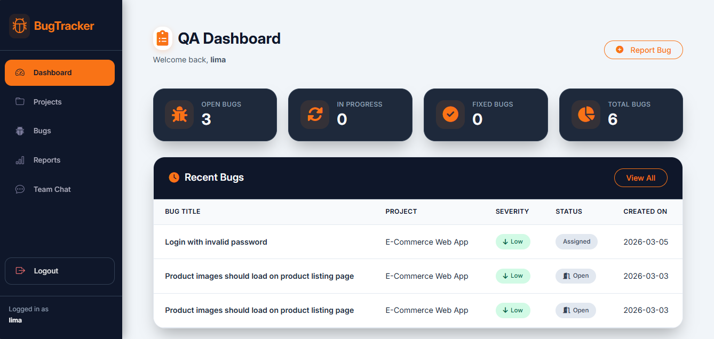
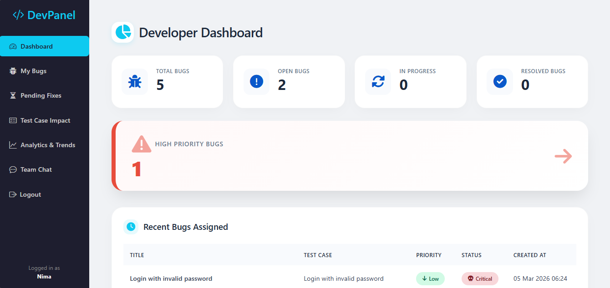
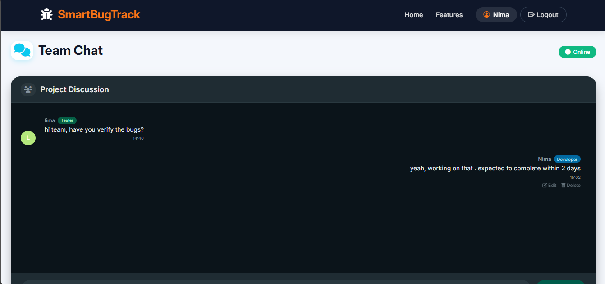

🐞 Smart Bug Tracking & Test Management System
https://img.shields.io/badge/Python-3.10%252B-blue.svg
https://img.shields.io/badge/Django-4.2-green.svg
https://img.shields.io/badge/Database-SQLite-blue.svg
https://img.shields.io/badge/Frontend-Bootstrap-7952b3.svg

A web‑based platform to manage bugs, test cases, and team collaboration with role‑based dashboards for Admins, Testers, and Developers.
📖 Table of Contents
Project Overview

Objectives

Existing vs Proposed System

User Roles

Modules

Technology Stack

Database Design

System Architecture

Features

Future Enhancements

Installation & Setup

Usage

Screenshots

Contributors

License

📌 Project Overview
The Smart Bug Tracking & Test Management System is a Django-based web application that streamlines the software testing and bug resolution process. It provides a centralized platform where testers can create and execute test cases, report bugs, and developers can manage assigned defects – all with full traceability. Admins have oversight of users, projects, and overall system health. The system is built to support manual testing workflows and is designed for easy extension to automation testing.

🎯 Objectives
Centralize bug tracking and test management in a single web application.

Provide role‑based access control (Admin, Tester, Developer).

Enable testers to create and execute test cases, and report bugs with severity/priority.

Allow developers to view assigned bugs, update status, and add comments.

Give admins a bird’s‑eye view of projects, users, and system activity.

Improve team communication and reduce delays caused by manual follow‑ups.

Lay a foundation for future automation testing integration.

📊 Existing vs Proposed System
Feature	Existing System	Proposed System
Centralized platform	❌ Spreadsheets/emails	✅ Web‑based dashboard
Test case management	❌ None	✅ Full CRUD and execution
Role‑based access	❌ None	✅ Admin, Tester, Developer
Real‑time bug status	❌ No	✅ Live updates and history
Traceability	❌ No	✅ Comments, status changes logged
Communication	❌ Scattered	✅ Integrated discussion per bug
Reporting	❌ Manual	✅ Analytics and charts
👥 User Roles
🔹 Admin
Manage users (create, edit, delete, assign roles)

View all projects, test cases, bugs

Assign testers to projects and developers to bugs

Monitor overall system statistics

🔹 Tester
Create, edit, and execute test cases

Report bugs with priority and severity

View own reported bugs and track their status

Participate in bug discussions

🔹 Developer
View bugs assigned to them

Update bug status (Open → In Progress → Resolved)

Upload fix files and add developer comments

Discuss bugs with testers via comments

🧩 Modules
🔐 Authentication Module
User registration and login

Role‑based redirection after login

Password hashing and CSRF protection

🧪 Test Management Module
Test Case Creation: Define title, steps, expected result, priority.

Test Execution: Record actual result and status (Pass/Fail/Blocked).

Test Case Listing: Filter by project/scenario.

Execution History: View past results for traceability.

🐛 Bug Tracking Module
Bug Reporting: Tester fills title, description, priority, and links to test case.

Bug Assignment: Admin assigns bugs to developers.

Status Lifecycle: Open → In Progress → Resolved → Closed.

Discussion: Comments on each bug (supports edit/delete).

File Attachments: Developers can upload fix files.

📊 Dashboard Module
Admin Dashboard: Overall stats, unassigned bugs, tester/developer lists.

Tester Dashboard: Bug counts by status, recent bugs, test execution progress.

Developer Dashboard: Assigned bugs, pending fixes, impact analysis.

🗨️ Communication Module
Inline comments per bug

Edit and delete own comments

Real‑time chat interface (WhatsApp‑style)

🛠️ Technology Stack
Backend: Django 4.2 (Python 3.10+)

Frontend: Bootstrap 5, HTML5, CSS3

Icons: Bootstrap Icons

Charts: Chart.js

Database: SQLite (development), can be swapped with PostgreSQL/MySQL

Version Control: Git & GitHub

🗄️ Database Design
The system uses the following main models (simplified):

Model	Fields
User	(Django built‑in) username, email, password, etc.
Profile	user (OneToOne), role, avatar
Project	name, description, testers (ManyToMany), developers (ManyToMany)
Scenario	project, title, description, priority, status
TestCase	scenario, title, steps, expected_result, actual_result, status
Bug	title, description, priority, status, test_case, reported_by, assigned_to, fix_file, developer_comment
BugComment	bug, user, comment, created_at
Report	title, project, created_by, priority, status, bugs (ManyToMany)
TeamChatMessage	project, user, message, created_at
Relationships are defined with Django ORM, ensuring referential integrity and efficient queries.

🏗️ System Architecture
The application follows a three‑tier architecture:

Presentation Layer – HTML templates with Bootstrap, served by Django views.

Business Logic Layer – Django views, forms, model methods, and decorators for access control.

Data Layer – SQLite database accessed through Django ORM.

Key patterns used:

MTV (Model‑Template‑View) pattern

Class‑based and function‑based views

Template inheritance

Custom decorators for role‑based access (@login_required, role checks)

✨ Features
✅ User Authentication – Sign up, login, logout, role‑based redirects.

✅ Admin Panel – Manage users, projects, assign roles, view system stats.

✅ Test Case Management – Create, edit, execute, and track test cases.

✅ Bug Lifecycle – From reporting to resolution, with status tracking.

✅ Developer Fix Upload – Upload files, add comments, update status.

✅ In‑line Comments – Discuss bugs directly with team members.

✅ Analytics – Charts for bug distribution, trends, severity.

✅ Responsive UI – Works on desktops, tablets, and mobile devices.

✅ Search & Filter – (Available on multiple views) quick navigation.

🔮 Future Enhancements
Automation Integration – Connect with Selenium/PyTest for automated test execution.

Email Notifications – Send alerts on bug assignment and status changes.

REST API – Expose endpoints for external tools and CI/CD integration.

Advanced Analytics – Custom reports, export to PDF/Excel.

WebSockets – Real‑time chat and notifications.

Multi‑project Support – Allow users to belong to multiple projects with fine‑grained permissions.

💻 Installation & Setup
Follow these steps to run the project locally.

Prerequisites
Python 3.10 or higher

Git

Virtual environment (recommended)

Steps
Clone the repository

bash
git clone https://github.com/yourusername/bug-tracking-system.git
cd bug-tracking-system
Create and activate virtual environment

bash
python -m venv venv
source venv/bin/activate   # On Windows: venv\Scripts\activate
Install dependencies

bash
pip install -r requirements.txt
Apply migrations

bash
python manage.py migrate
Create a superuser (Admin)

bash
python manage.py createsuperuser
Run the development server

bash
python manage.py runserver
Access the application
Open your browser at http://127.0.0.1:8000/

🚀 Usage
Admin: Log in with superuser credentials. Navigate to /admin/ or the custom admin dashboard.
Manage users, assign projects/testers, view system stats.

Tester: Register as a tester (or have admin create). After login, you'll see the tester dashboard.
Create scenarios, test cases, execute them, and report bugs.

Developer: Register as a developer. View assigned bugs, update status, upload fixes, and discuss with testers.

All dashboards provide relevant actions and quick links.

📸 Screenshots

### Admin Dashboard

### Tester Dashboard

### Developer Dashboard

### Team Chat

👩‍💻 Contributors
LIMA – MCA Student
Project Lead, Backend & Frontend Development

Special thanks to faculty mentors and peers for their guidance.

📄 License
This project is for academic and learning purposes only. It is not licensed for commercial use. All code is original and developed as part of the MCA final year project.

